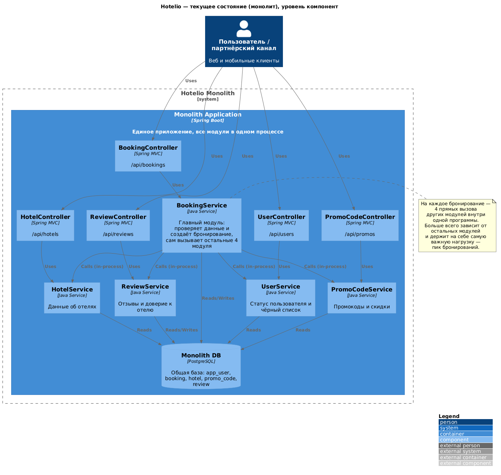
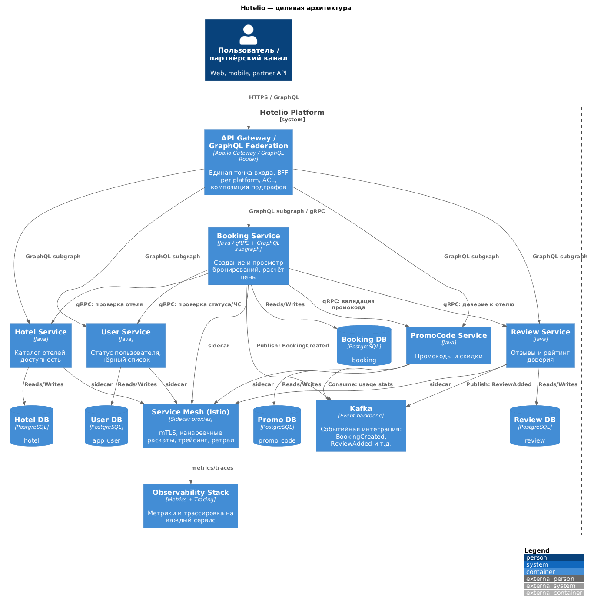
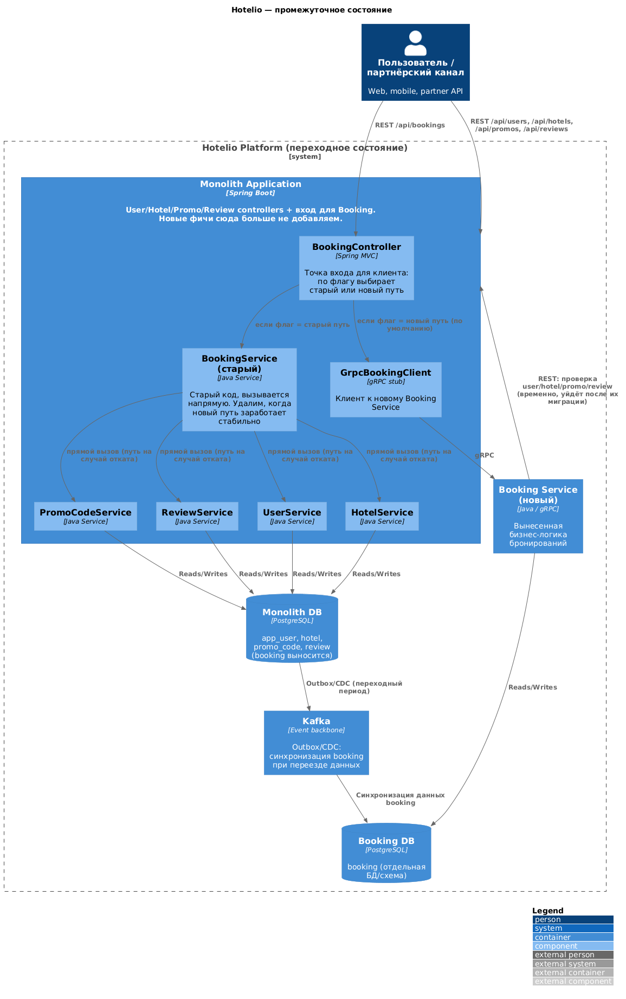

### **Название задачи:**
Целевая архитектура Hotelio и план перехода от монолита к микросервисам

### **Автор:**
skorogod

### **Дата:**
2026-09-18

---

### **Функциональные требования**

Ниже — основные сценарии использования, взятые из текущего REST API монолита (`architecture/readme.md`). Как бы мы ни меняли архитектуру внутри, снаружи всё должно работать так же, как сейчас (это проверяется тестами `test/regress.sh`).

| **№** | **Действующие лица или системы** | **Use Case** | **Описание** |
| :-: | :- | :- | :- |
| 1 | Пользователь | Создать бронирование | `POST /api/bookings` — проверяем пользователя (активен, не в чёрном списке), проверяем отель (работает, не переполнен, ему доверяют по отзывам), применяем промокод, считаем итоговую цену, сохраняем бронирование |
| 2 | Пользователь | Посмотреть свои бронирования | `GET /api/bookings?userId=...` — список бронирований одного пользователя или вообще всех |
| 3 | Пользователь / процесс бронирования | Узнать статус пользователя | `GET /api/users/{id}`, `/status`, `/blacklisted`, `/active`, `/authorized`, `/vip` |
| 4 | Пользователь / процесс бронирования | Получить информацию об отеле | `GET /api/hotels/{id}`, `/operational`, `/fully-booked`, `/by-city`, `/top-rated` |
| 5 | Пользователь / процесс бронирования | Проверить и применить промокод | `GET /api/promos/{code}`, `/valid`, `POST /api/promos/validate` |
| 6 | Пользователь / процесс бронирования | Посмотреть отзывы и доверие к отелю | `GET /api/reviews/hotel/{id}`, `/trusted` |

### **Нефункциональные требования**

| **№** | **Требование** |
| :-: | :- |
| 1 | Можно масштабировать (увеличивать количество копий) именно сервис бронирований под пиковую нагрузку, не трогая остальные модули |
| 2 | Каждый сервис можно выкатывать в прод отдельно — изменение одного модуля не требует пересборки и тестирования всего приложения целиком |
| 3 | Разные команды (Java, DevOps, фронтенд) могут работать параллельно и не мешать друг другу в одной кодовой базе |
| 4 | Если упадёт не самый важный модуль (например, Review), это не должно останавливать создание бронирований |
| 5 | Разным платформам (веб, мобильное приложение, партнёры) можно отдавать данные под их нужды через GraphQL, а не один универсальный REST-ответ на всех |
| 6 | По каждому сервису отдельно можно посмотреть метрики и путь запроса (трассировку), а не только по приложению в целом |
| 7 | Во время миграции поведение API не должно меняться для тех, кто им уже пользуется (проверяем через `test/regress.sh`) |
| 8 | При разделении одной общей базы данных на несколько нужно не потерять согласованность данных, учитывая, что DevOps-инженер у нас один |

---

### **Решение**

#### Какие проблемы есть сейчас

1. **Сложно сопровождать, всё сильно завязано друг на друга.** `BookingService` (`hotelio-monolith/.../service/BookingService.java`) — это единственный модуль, который сам напрямую вызывает `UserService`, `HotelService`, `PromoCodeService` и `ReviewService`. Если поменять любой из этих четырёх сервисов, есть риск сломать Booking. Схема текущего состояния:

*(исходник диаграммы: [`diagrams/current-state-component.puml`](diagrams/current-state-component.puml))*

2. **Одна база данных на всё.** Таблицы `app_user`, `booking`, `hotel`, `promo_code`, `review` лежат в одной и той же базе PostgreSQL (`hotelio`). Нельзя увеличить хранилище под один конкретный модуль и нельзя поменять схему одной таблицы, не рискуя задеть остальные.
3. **Распределение нагрузки.** Больше всего нагрузки — на создание бронирований (`POST /bookings`), но масштабировать можно только весь монолит целиком.
4. **REST один на всех.** API одинаковый для всех платформ (веб/мобильные/партнёры), и он слишком общий — нет отдельного слоя под конкретную платформу (BFF). Из-за этого фронтенду приходится делать несколько запросов и получать лишние данные.
5. **Риски при релизах.** Кодовая база одна, поэтому любой релиз — это релиз всего приложения сразу. Чтобы протестировать что-то одно, нужно понимать, как всё остальное с ним связано (`BookingService` знает про 4 других модуля).

#### Общий план

*(исходник диаграммы: [`diagrams/target-state-container.puml`](diagrams/target-state-container.puml))*

- Каждый модуль (Booking, User, Hotel, PromoCode, Review) — отдельный сервис со своей базой данных.
- Используем API Gateway, который через GraphQL собирает ответ из нужных сервисов.
- Сервисы общаются друг с другом через gRPC. Это быстрее.
- Kafka используется для асинхронного взаимодействия между сервисами. Например, при бронировании или отправке отзыва.
- Service mesh (Istio) — управляет сетью между сервисами.
- Сбор метрик и трассировка запросов для каждого сервиса.

#### Первый этап

*(исходник диаграммы: [`diagrams/intermediate-state-container.puml`](diagrams/intermediate-state-container.puml))*

- Выносим только **один** модуль — **Booking** (схема — [`ADR-002-strangler-fig-booking.md`](ADR-002-strangler-fig-booking.md)).
- Остальные модули (User, Hotel, PromoCode, Review) пока остаются в монолите без изменений.
- Новый Booking Service пока обращается к монолиту по обычному REST, чтобы проверить пользователя, отель, промокод и отзывы.
- Начинаем разделять базу данных: таблица `booking` переезжает в отдельную БД, а на время переноса данные синхронизируются через Kafka.

#### Обоснование выбора технологий

- **gRPC внутри системы, REST/GraphQL — снаружи.** Для вызовов между сервисами важна скорость и чёткий контракт — это даёт gRPC. Для фронтенда важнее гибкость запроса — это даёт GraphQL.
- **Strangler Fig, а не переписывание с нуля.** Команда маленькая (2 Java-разработчика), и нельзя останавливать текущие бизнес-процессы (продажи) ради переписывания. Поэтому выносим по одному модулю, а монолит продолжает работать рядом.
- **Kafka пока используется по минимуму** — только чтобы синхронизировать данные Booking при переносе. Полноценно её использовать для событий между всеми сервисами будем уже в финальной архитектуре.

---

### **Альтернативы**

1. **Переписать всё с нуля (big-bang).** Отклонили: у нас всего 2 Java-разработчика, они не могут одновременно поддерживать текущий продакшн и писать всё заново. Слишком велик риск долгого простоя и того, что старая и новая версии логики начнут расходиться.
2. **Сначала вынести UserService** (потому что от него зависят все остальные модули). Отклонили: `UserService` читают почти все модули, и если вынести его первым, все они сразу станут зависеть от сети, а не от обычного вызова внутри программы — это большой риск сразу для всей системы. При этом пользы бизнесу от этого меньше, чем от возможности отдельно масштабировать именно Booking под пиковую нагрузку.
3. **Сделать все вызовы между сервисами через REST**, а не gRPC. Отклонили для внутренних вызовов — у gRPC есть чёткий контракт (protobuf) и меньше задержка, и мы уже начали так делать в `tasks/task2` (`booking.proto`). REST и GraphQL оставили для внешнего API, где важнее гибкость, а не скорость.
4. **Писать данные сразу в обе базы** (старую и новую) вместо переноса через Kafka. Это проще сделать, но если одна из двух записей не пройдёт из-за сбоя, данные в базах разойдутся.

**Недостатки, ограничения, риски**

- Пока держим два пути в коде (старый `BookingService` и новый через gRPC) — это временно усложняет монолит. Уберём это сразу после того, как убедимся, что новый путь работает так же хорошо, как старый.
- Появляется новый сетевой вызов между монолитом и Booking Service, также будут выполняться запросы от BookingService к монолиту за данными о пользователе и так далее.
- Пока не все модули вынесены, часть связей между данными (например, ссылки Booking на `hotelId`/`userId`) держится не на уровне базы данных, а просто в коде.
- Регрессионные тесты (`test/regress.sh`) проверяют только обычные (успешные) сценарии через REST. Когда появится gRPC-путь между монолитом и Booking Service, его тоже нужно будет покрыть тестами.
