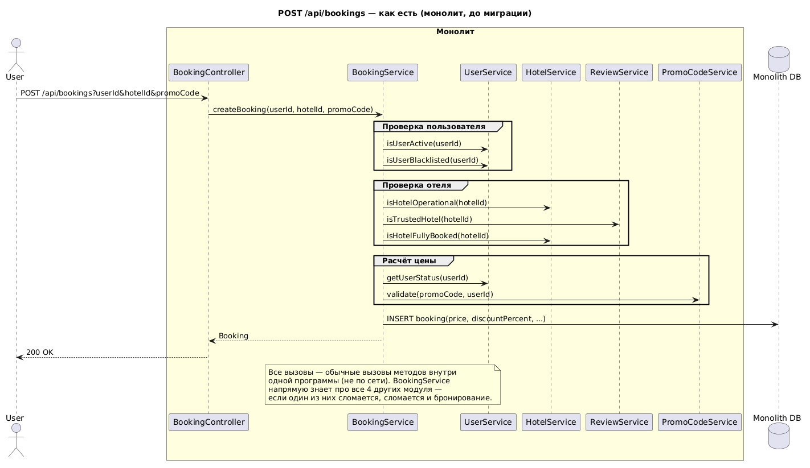
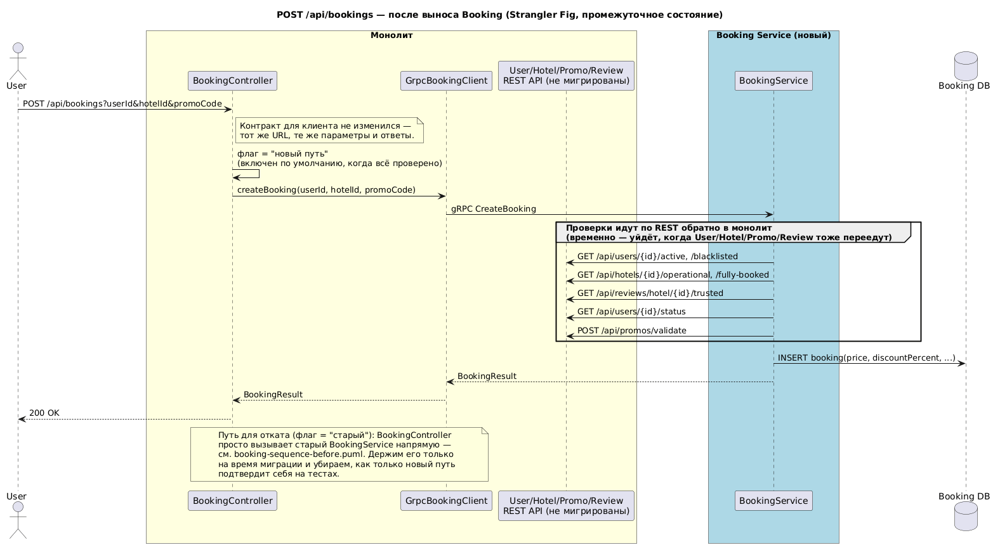

### **Название задачи:**
Выбор первого модуля для миграции и план Strangler Fig для Booking

### **Автор:**
skorogod

### **Дата:**
2026-09-18

---

### **Функциональные требования**

| **№** | **Действующие лица или системы** | **Use Case** | **Описание** |
| :-: | :- | :- | :- |
| 1 | Пользователь | Создать бронирование и не заметить миграцию | `POST /api/bookings` работает так же, как раньше: те же проверки, тот же расчёт цены, те же ошибки |
| 2 | Пользователь | Посмотреть свои бронирования | `GET /api/bookings` работает точно так же, как до миграции |
| 3 | Команда разработки | Быстро откатиться назад | Если с новым Booking Service что-то пойдёт не так, можно вернуться на старый код без пересборки и передеплоя |
| 4 | Тестировщик | Убедиться, что ничего не сломалось | `test/regress.sh` должен давать одинаковый результат и до, и после выноса Booking |

### **Нефункциональные требования**

| **№** | **Требование** |
| :-: | :- |
| 1 | Переключение между старым и новым способом обработки бронирования не должно останавливать сервис (переключаем флагом/конфигом, без простоя) |
| 2 | Новый путь (gRPC + обращения по REST обратно в монолит) не должен работать заметно медленнее старых прямых вызовов внутри одного приложения |
| 3 | Перенос данных `booking` в новую базу не должен терять записи и не должен мешать создавать новые бронирования во время переноса |
| 4 | Всё это должны суметь сделать 2 Java-разработчика и 1 DevOps-инженер, не останавливая продажи |

---

### **Решение**

#### Почему первым мигрируем именно Booking

1. **Больше всего пользы от независимого масштабирования.** При пиковых нагрузках (например, на бронирование) нельзя масштабировать только нужный компонент. Это проблема именно BookingService.
2. **У Booking уже есть чёткая граница.** Один контроллер (`BookingController`), одна сущность (`Booking`), один репозиторий. Значит, риск при переносе ниже, чем, например, у User (от него все остальные модули зависят на чтение) или Hotel (нужен и для бронирования, и для показа списка отелей).
3. **Меньше риск задеть всё остальное.** Если первым вынести User или Hotel, придётся сразу переделывать код во всех модулях, которые к ним обращаются. А Booking, наоборот, сам обращается к остальным, но к нему никто не обращается — значит, поменяется только код внутри Booking.

Другие варианты и почему мы их не выбрали — см. раздел "Альтернативы".

#### План миграции (Strangler Fig)

Диаграмма для запроса `POST /api/bookings` — как есть, до миграции:

*(исходник: [`diagrams/booking-sequence-before.puml`](diagrams/booking-sequence-before.puml))*

Тот же запрос после выноса Booking (переключение по флагу и обратные вызовы в монолит):

*(исходник: [`diagrams/booking-sequence-after.puml`](diagrams/booking-sequence-after.puml))*

Промежуточная архитектура после выноса Booking в отдельный сервис:

*(исходник: [`diagrams/intermediate-state-container.puml`](diagrams/intermediate-state-container.puml))*

1. **Extract.** Переносим код `BookingService` в отдельный сервис `booking-service`. У него своя база/схема для таблицы `booking`.
2. **Адаптер в монолите.** `BookingController` остаётся точкой входа для клиентов. Внутри используем флаг: либо вызываем старый `BookingService`, либо через `GrpcBookingClient` обращается в новый `booking-service`. Флаг задаётся в конфиге, для возможности откатиться к legacy версии.
4. **Временное решение с обратными вызовами.** Пока User/Hotel/PromoCode/Review не вынесены отдельно, новый `booking-service` ходит за проверками в монолит обычными REST-запросами (`/api/users/...`, `/api/hotels/...`, `/api/promos/validate`, `/api/reviews/hotel/{id}/trusted`).
5. **Перенос данных.** Таблица `booking` переезжает в отдельную базу. Пока идёт перенос, данные синхронизируем через Kafka (outbox/CDC — Kafka в проекте уже есть), а не одновременной записью сразу в обе базы: если одна из двух записей не пройдёт из-за сбоя, данные в базах разъедутся, и это сложно заметить вовремя.
6. **Cutover (переключение).** Включаем флаг "new", что позволит нам отправлять запросы к новому booking-service. Прогоняем `test/regress.sh` — он должен пройти так же, как на старом монолите. Старый код и старую таблицу `booking` в монолите пока не удаляем на случай отката.
7. **Дальше — по одному модулю.** После того как Booking заработал стабильно, так же выносим Hotel и Review (они меньше всего с чем-то связаны и в основном только читают данные), потом PromoCode, и в последнюю очередь User.

---

### **Альтернативы**

1. **Начать с ReviewService.** Это самый простой по логике модуль, но польза от его выноса будет невелика.
2. **Начать с UserService**, потому что от него все остальные зависят. Отказались от этого варианта, потому что если вынести общий модуль первым, придётся сразу переделывать код во всех местах, которые его вызывают (Booking и, возможно, другие).
3. **Писать данные сразу в обе базы** (и в старую, и в новую) вместо Kafka outbox/CDC. Это проще сделать, но если одна из двух записей не пройдёт из-за сбоя сети, данные в базах разойдутся. Раз Kafka в проекте уже есть.

**Недостатки, ограничения, риски**

- Обратные вызовы из `booking-service` в монолит по REST. Нужны таймауты, ретраи.
- Пока держим два пути в `BookingController` (старый и новый).
- Перенос данных `booking` через Kafka (outbox/CDC).
- `test/regress.sh` проверяет только REST. Путь через gRPC между монолитом и `booking-service` пока никак не покрыт автотестами. Это нужно сделать до того, как флаг "new" станет включён по умолчанию (шаг 6).
