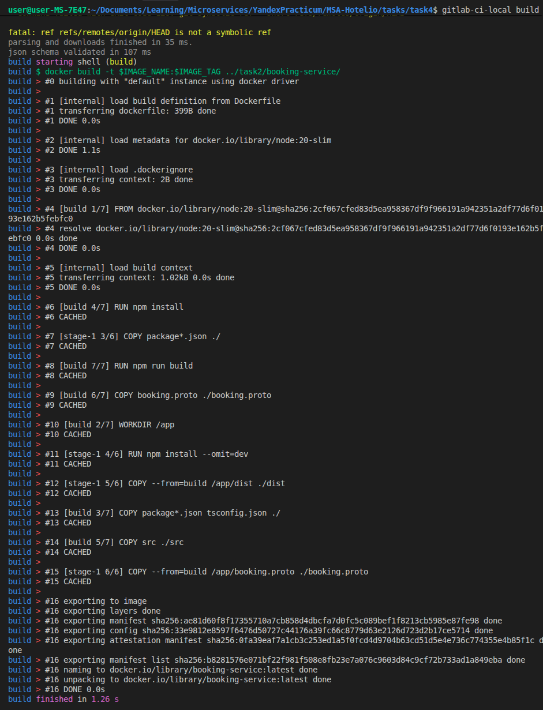
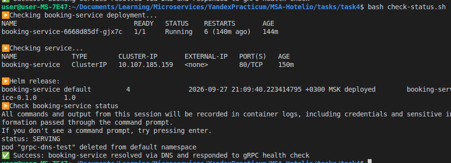
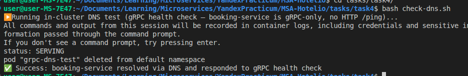

# Отчет о выполнении задания №4
Для деплоя booking-service в minikube создан [helm-chart](../helm/) c двумя вариантами values.yaml: для [stagind](../helm/booking-service/values-staging.yaml) и [prod](../helm/booking-service/values-prod.yaml) окружений.

Создан [CI/CD конвейер](../.gitlab-ci.yml)

Так как booking-service был разработан с использованием протокола взаимодействия gRPC, было принято решение, что проверка состояния сервиса будет осуществляться также с помощью gRPC проб.

Для этого при выполнении проб нам нужно установить компилированную Go-утилиту от gRPC-ecosystem

`curl -sSL -o grpc_health_probe https://github.com/grpc-ecosystem/grpc-health-probe/releases/latest/download/grpc_health_probe-linux-amd64`

После установки утилиты проверяем состояние сервиса

`./grpc_health_probe -addr=localhost:9090 -service=readiness`

Для реализации ServiceDiscovery создан [сервис](../helm/booking-service/templates/service.yaml)

## Скриншоты

### Сборка образа

`gitlab-ci-local build`: выполняется стадия `build` из `.gitlab-ci.yml` — `docker build` собирает многоступенчатый образ `booking-service` из исходников `../task2/booking-service/` (сборка зависимостей, компиляция TypeScript, копирование `dist` и `booking.proto` в финальный слой). Большая часть шагов помечена `CACHED`, стадия завершается за 1.26 с.

### Список Docker-образов

`docker image ls | grep booking`: локально собранные образы `booking-service:latest` (используется деплоем) и `hotelio/booking-service:latest` (более ранний вариант с префиксом registry, оставшийся от промежуточного шага работы над CI).

### Образы внутри Minikube

`minikube image list`: помимо служебных образов кластера (`kube-scheduler`, `kube-proxy`, `etcd` и т.д.) видно, что `docker.io/library/booking-service:latest` (загружен командой `minikube image load` из джоба `deploy`), а также `postgres:15` и `apache/kafka:3.7.0` (зависимости сервиса) присутствуют внутри Minikube и доступны подам с `imagePullPolicy: Never`.

### Состояние подов

`kubectl get pods`: под `booking-service`, а также вспомогательные `booking-postgres` и `booking-kafka` (поднятые в рамках того же Helm-релиза для локального окружения) — все в статусе `Running`, `1/1 Ready`.

### Состояние сервисов

`kubectl get services`: `booking-service` (`ClusterIP`, порт `80` → `targetPort` 9090 внутри пода), `booking-postgres` (`5432`) и `booking-kafka` (`9092`) — все типа `ClusterIP`, доступны по DNS-именам внутри кластера.

### Проверка статуса деплоя

`check-status.sh`: под `booking-service` в статусе `Running`, Service существует и слушает порт `80`, Helm-релиз `booking-service` задеплоен (revision 4, chart `booking-service-0.1.0`), а gRPC health-check (`grpc_health_probe`) возвращает `status: SERVING`.

### Проверка Service Discovery

`check-dns.sh`: из временного пода (`busybox`/`alpine`), запущенного внутри кластера, сервис `booking-service` резолвится по DNS-имени и отвечает на gRPC health-check (`status: SERVING`), после чего временный под удаляется. Это подтверждает, что service discovery через DNS работает без необходимости знать IP-адрес пода.